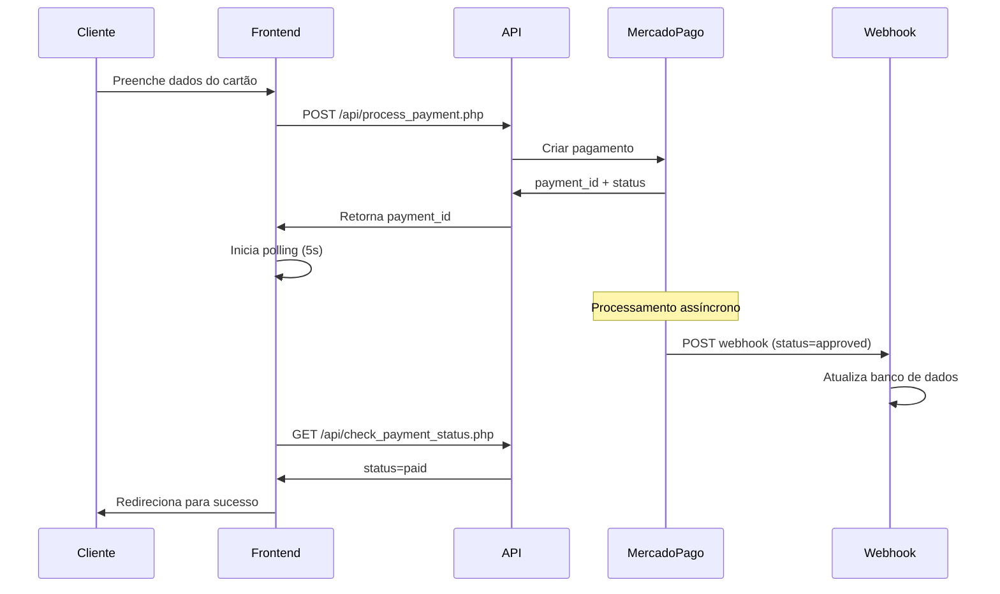
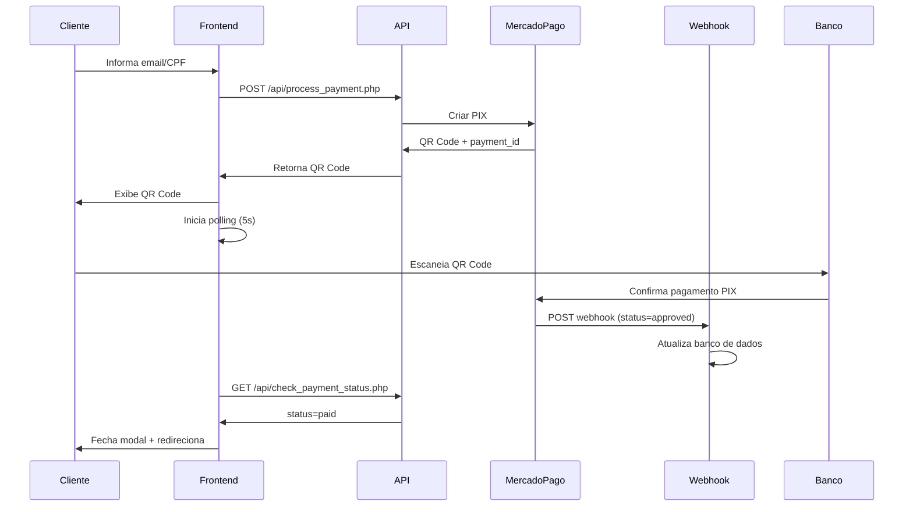

# 🔔 **CONFIGURAÇÃO DE WEBHOOKS - MERCADO PAGO**

## 📋 **Como o Sistema de Pagamentos Funciona**

### 🎯 **Fluxo Completo:**

1. **Cliente faz o pagamento** (PIX ou Cartão)
2. **Sistema cria pagamento** no Mercado Pago via API
3. **Frontend inicia polling** para verificar status
4. **Mercado Pago envia webhook** quando status muda
5. **Webhook atualiza banco de dados** automaticamente
6. **Polling detecta mudança** e atualiza interface
7. **Cliente é redirecionado** para página de sucesso

---

## 🚀 **1. CONFIGURAR WEBHOOK NO PAINEL DO MERCADO PAGO**

### **Passo a passo:**

1. **Acesse:** https://www.mercadopago.com.br/developers/panel/webhooks

2. **Clique em "Criar webhook"**

3. **Configure:**
   ```
   Nome: Sistema UNLI - Pagamentos
   URL: https://seu-dominio.com/api/webhook_mercadopago.php
   Eventos: payment (✅ marcar apenas este)
   ```

4. **Teste a URL** usando o botão "Testar webhook"

5. **Ative o webhook**

---

## 🔧 **2. VERIFICAR CONFIGURAÇÃO DO SERVIDOR**

### **Arquivo necessário:** `api/config.secure.php`

```php
<?php
// Credenciais do Mercado Pago
define('MP_PUBLIC_KEY', 'APP_USR-xxxxxxx'); // Sua chave pública
define('MP_ACCESS_TOKEN', 'APP_USR-xxxxxxx'); // Seu access token

// Configuração do banco de dados
define('DB_HOST', 'localhost');
define('DB_USER', 'seu_usuario');
define('DB_PASS', 'sua_senha');
define('DB_NAME', 'seu_banco');
```

### **Testar webhook manualmente:**
```bash
curl -X POST https://seu-dominio.com/api/webhook_mercadopago.php \
  -H "Content-Type: application/json" \
  -d '{
    "type": "payment",
    "data": {
      "id": "123456789"
    }
  }'
```

---

## 📱 **3. COMO FUNCIONA CADA MÉTODO DE PAGAMENTO**

### **💳 Cartão de Crédito:**


### **📱 PIX:**


---

## 🛠️ **4. ENDPOINTS IMPLEMENTADOS**

### **📤 Processar Pagamento**
```
POST /api/process_payment.php

Body (Cartão):
{
  "order_id": "ORD-20241223-ABC12345",
  "payment_method": "credit_card",
  "transaction_amount": 1189.00,
  "installments": 1,
  "token": "card_token_from_mercadopago",
  "payment_method_id": "visa",
  "payer": {
    "name": "João Silva",
    "email": "joao@email.com",
    "identification": {
      "type": "CPF",
      "number": "12345678901"
    }
  }
}

Body (PIX):
{
  "order_id": "ORD-20241223-ABC12345",
  "payment_method": "pix",
  "transaction_amount": 1189.00,
  "payer": {
    "email": "joao@email.com",
    "identification": {
      "type": "CPF",
      "number": "12345678901"
    }
  }
}

Response:
{
  "success": true,
  "payment_id": "123456789",
  "status": "pending",
  "qr_code": "00020126360014...", // Apenas para PIX
  "qr_code_base64": "data:image/png;base64..." // Opcional
}
```

### **📥 Verificar Status**
```
GET /api/check_payment_status.php?payment_id=123456789&order_id=ORD-123

Response:
{
  "ok": true,
  "status": "paid", // paid | pending | failed | refunded
  "payment_id": "123456789",
  "order_id": "ORD-20241223-ABC12345",
  "source": "mercadopago", // database | mercadopago | database_fallback
  "updated_at": "2024-12-23 14:30:00"
}
```

### **🔔 Webhook Receiver**
```
POST /api/webhook_mercadopago.php

Body (do Mercado Pago):
{
  "type": "payment",
  "data": {
    "id": "123456789"
  }
}

Response:
{
  "ok": true,
  "processed": true
}
```

---

## 🔍 **5. MONITORAMENTO E DEBUG**

### **📋 Logs disponíveis:**
```
/api/logs/webhook_2024-12-23.log      # Webhooks recebidos
/api/logs/status_check_2024-12-23.log # Verificações de status
/api/logs/payment_2024-12-23.log      # Processamento de pagamentos
```

### **🧪 Testar integração:**

1. **Verificar credenciais:**
```bash
curl -H "Authorization: Bearer SEU_ACCESS_TOKEN" \
     https://api.mercadopago.com/v1/payments/search
```

2. **Testar endpoint de status:**
```bash
curl "https://seu-dominio.com/api/check_payment_status.php?order_id=ORD-123"
```

3. **Simular webhook:**
```bash
curl -X POST https://seu-dominio.com/api/webhook_mercadopago.php \
  -H "Content-Type: application/json" \
  -d '{"type":"payment","data":{"id":"123"}}'
```

### **🔧 Debug no navegador:**
- Abra DevTools (F12)
- Aba Console: veja logs do polling
- Aba Network: verifique requisições para APIs
- Status em tempo real é exibido na interface

---

## ⚠️ **6. RESOLUÇÃO DE PROBLEMAS COMUNS**

### **❌ Webhook não está sendo chamado:**
- Verifique se a URL está acessível externamente
- Teste com `curl` ou Postman
- Confirme se o webhook está ativo no painel MP
- Verifique logs do servidor web

### **❌ Polling não detecta mudanças:**
- Verifique se `check_payment_status.php` está funcionando
- Confirme se o banco de dados está sendo atualizado pelo webhook
- Verifique console do navegador para erros JavaScript

### **❌ Pagamento fica "pendente" para sempre:**
- Verifique se o `external_reference` está sendo enviado corretamente
- Confirme se o webhook consegue mapear payment_id para order_id
- Teste pagamento com cartão de teste do Mercado Pago

### **💡 Cartões de teste (Sandbox):**
```
Cartão aprovado: 4000 0000 0000 0010
Cartão rejeitado: 4000 0000 0000 0002
CVV: qualquer 3 dígitos
Vencimento: qualquer data futura
Nome: qualquer nome
```

---

## 🎯 **7. PRÓXIMOS PASSOS**

1. ✅ **Configurar webhook no painel MP**
2. ✅ **Testar com pagamentos reais** (ambiente de produção)
3. ✅ **Implementar envio de e-mail** quando pagamento for aprovado
4. ✅ **Adicionar retry logic** para webhooks falhados
5. ✅ **Implementar refunds** via painel admin
6. ✅ **Monitoramento** com alertas de erro

---

## 📞 **SUPORTE**

Se houver problemas na integração:

1. **Verificar logs** em `/api/logs/`
2. **Testar endpoints** individualmente
3. **Consultar documentação** do Mercado Pago
4. **Verificar status** no painel do MP

**Documentação oficial:** https://www.mercadopago.com.br/developers/